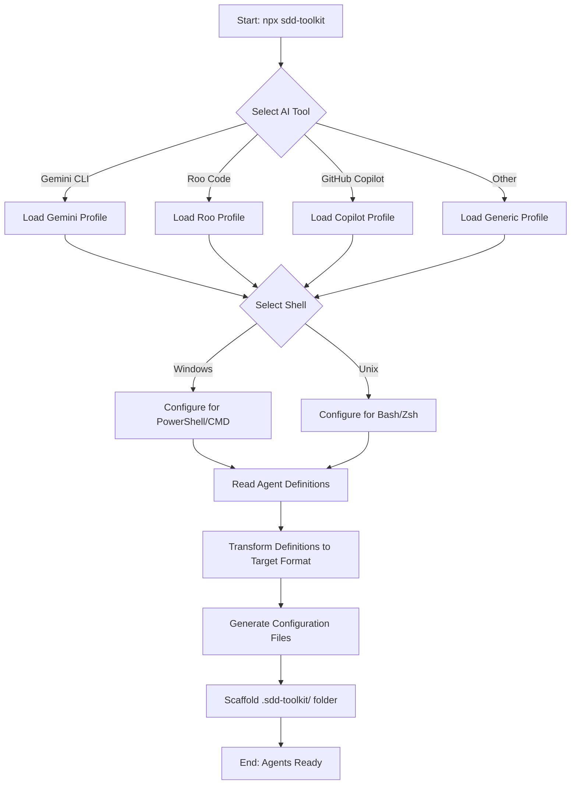

# sdd-toolkit

## 1. Overview
**sdd-toolkit** is a Universal Specification CLI and "AI Agent Package Manager". Its primary function is to automate the installation and configuration of a standardized squad of AI Developers (Project Architect, Requirements Engineer, Coder, etc.) into various modern AI coding assistants (Gemini CLI, Roo Code, GitHub Copilot, Cursor, etc.). It transforms agnostic agent definitions into tool-specific configurations, enabling a consistent, structured, and documentation-driven workflow regardless of the underlying AI tool.

## 2. Business Objectives
- **Standardize AI Workflows:** Enforce a proven development lifecycle (Spec -> Plan -> Code) across different AI tools to reduce hallucinations and improve code quality.
- **Portability:** Allow developers to switch between AI tools (e.g., from Cursor to Roo Code) without losing their agent workflow.
- **Automation:** Eliminate the manual setup of prompts, system instructions, and configuration files for each AI tool.
- **Context Management:** Automatically structure the project documentation (`.sdd-toolkit/`) to serve as the "long-term memory" for AI agents.

## 3. Actors and Personas
- **Developer (User):** The human operator who runs the toolkit to set up their environment and interacts with the installed AI agents to build software.
- **AI Agent (The Squad):** Specialized personas (Architect, Coder, Auditor) installed by the toolkit.
- **Host AI Tool:** The platform running the agents (e.g., Gemini CLI, VS Code extensions like Cline/Roo, GitHub Copilot).

## 4. Modules and Features Structure
### Module: Core CLI
- **Installation Wizard:** Interactive command-line interface (using `@clack/prompts`) to guide the user through setup.
- **Environment Detection:** Detects or asks for the operating system (Windows/Unix) to tailor shell commands in agent instructions.
- **Docs Scaffolding:** Automatically creates the `.sdd-toolkit/` and `.sdd-toolkit/logs/` directory structure required by the workflow.

### Module: Definitions Engine
- **YAML Loader:** Reads agent definitions from the internal `definitions/` library or a local `agents.md` file.
- **Schema Validation:** Ensures agent definitions contain all required fields (identity, triggers, instructions).

### Module: Transformers
- **Gemini Transformer:** Converts YAML to `.toml` configuration files for Gemini CLI.
- **Roo/Cline Transformer:** Converts YAML to `_custom_modes.json` and context rules.
- **Copilot Transformer:** Generates `.github/copilot-instructions.md` and agent files.
- **General Transformer:** Handles output for Cursor, Windsurf, Trae, OpenCode, Kilo Code, and web-based prompts.

## 5. User Journey (Flow)

## 6. Business Rules
- **[BR01] Agnostic Definitions:** Agents must be defined in a tool-agnostic YAML format to ensure portability.
- **[BR02] Structure Enforcement:** The toolkit must verify or create the `.sdd-toolkit/` folder structure, as the agents rely on specific file paths (`.sdd-toolkit/project.md`, `.sdd-toolkit/requirements.md`, etc.).
- **[BR03] Non-Destructive Installation:** The toolkit should prioritize safety, ensuring it doesn't accidentally wipe out unrelated user configurations (though it may overwrite specific agent files it manages).
- **[BR04] Role Separation:** Each agent must have a distinct responsibility and restricted context where possible (e.g., "Coder" focuses on execution, "Architect" on planning).

## 7. External Integrations
- **File System:** Direct read/write access to the user's project directory.
- **NPM/NPX:** Distribution mechanism.

## 8. Non-Functional Requirements & Constraints
- **Performance:** CLI start-up and execution should be near-instant.
- **Compatibility:** Must work on Node.js environments (Windows, macOS, Linux).
- **Dependencies:** Minimal runtime dependencies to ensure fast `npx` execution.
- **Testing Strategy:** Manual testing of generated artifacts across different AI tools.

## 9. Data Definitions
### AgentDefinition
- `name`: String (e.g., "dev.coder")
- `role`: String (e.g., "Senior Developer")
- `description`: String
- `instructions`: String (System prompt)
- `triggers`: Array<String> (e.g., ["/dev.coder"])

### TargetProfile
- `key`: String (e.g., "gemini", "roo")
- `configPath`: String (Destination for config files)
- `format`: Enum (TOML, JSON, Markdown)

## 10. Project Principles (Constitution)
- **[P1] "Context is King":** The system relies on file-based context (`.sdd-toolkit/*.md`). The toolkit's job is to enable this context mechanism.
- **[P2] Tool Agnostic:** The core logic must never be coupled to a specific AI tool's API; it only generates configuration files.
- **[P3] Simplicity:** The user interface should be a simple "Wizard" style flow.
